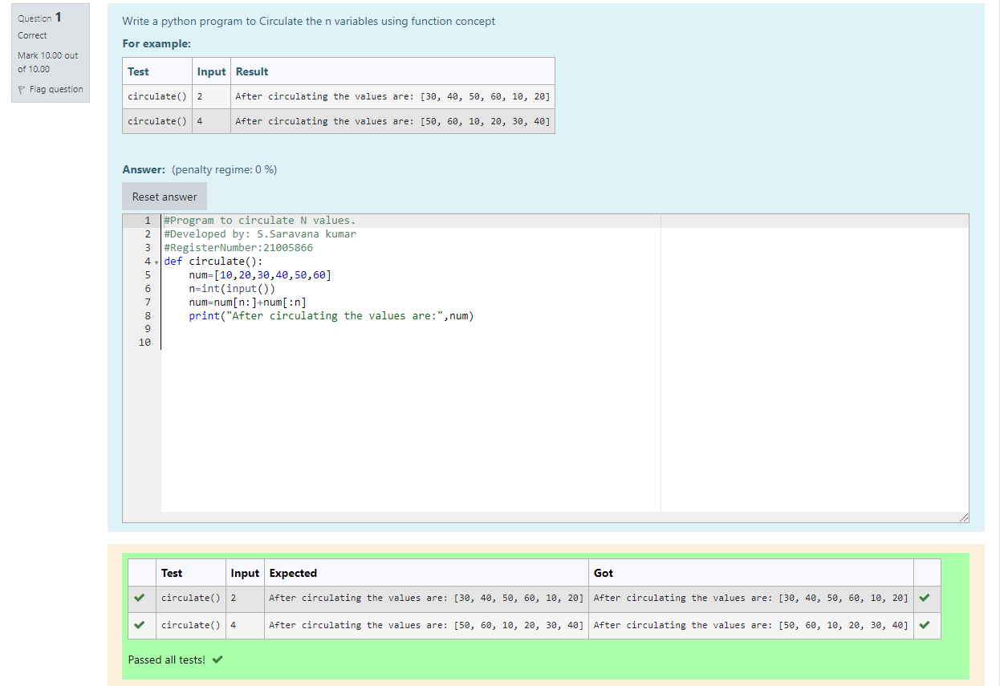

# Circulate-the-values-of-N-variables
## Aim:
To write a python program to circulate the n variables using function concept
## Equipment’s required:
PC
Anaconda - Python 3.7
## Algorithm:  
### Step 1: 
Get the value from the user for the number of rotation.
### Step 2: 
Using the slicing concept rotate the list.
### Step 3:
Then print the circulated values.
## Program:
```
def circulate():
    num=[10,20,30,40,50,60]
    n=int(input())
    num=num[n:]+num[:n]
    print("After circulating the values are:",num)
```
## Output:

## Result:
Hence we circulated the values using function concept.